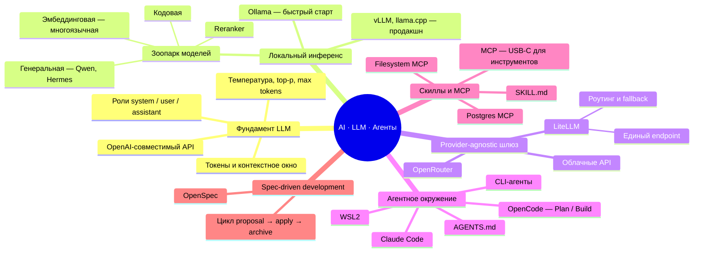

```mermaid
mindmap
  root((AI · LLM · Агенты))
    Фундамент LLM
      Токены и контекстное окно
      Температура, top-p, max tokens
      Роли system / user / assistant
      OpenAI-совместимый API
    Локальный инференс
      Ollama — быстрый старт
      vLLM, llama.cpp — продакшн
      Зоопарк моделей
        Генеральная — Qwen, Hermes
        Кодовая
        Эмбеддинговая — многоязычная
        Reranker
    Provider-agnostic шлюз
      LiteLLM
        Единый endpoint
        Роутинг и fallback
      Облачные API
      OpenRouter
    Агентное окружение
      CLI-агенты
      WSL2
      OpenCode — Plan / Build
      Claude Code
      AGENTS.md
    Скиллы и MCP
      SKILL.md
      MCP — USB-C для инструментов
      Postgres MCP
      Filesystem MCP
    Spec-driven development
      OpenSpec
      Цикл proposal → apply → archive
```