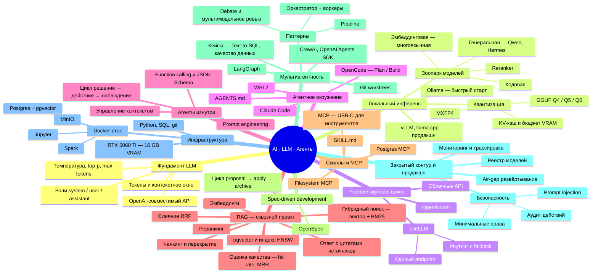

```mermaid
mindmap
  root((AI · LLM · Агенты))
    Фундамент LLM
      Токены и контекстное окно
      Температура, top-p, max tokens
      Роли system / user / assistant
      OpenAI-совместимый API
    Локальный инференс
      Ollama — быстрый старт
      vLLM, llama.cpp — продакшн
      Квантизация
        GGUF Q4 / Q5 / Q6
        MXFP4
        KV-кэш и бюджет VRAM
      Зоопарк моделей
        Генеральная — Qwen, Hermes
        Кодовая
        Эмбеддинговая — многоязычная
        Reranker
    Provider-agnostic шлюз
      LiteLLM
        Единый endpoint
        Роутинг и fallback
      Облачные API
      OpenRouter
    Агентное окружение
      WSL2
      OpenCode — Plan / Build
      Claude Code
      AGENTS.md
    Агенты изнутри
      Цикл решение → действие → наблюдение
      Function calling и JSON Schema
      Управление контекстом
      Prompt engineering
    RAG — сквозной проект
      Эмбеддинги
      Чанкинг и перекрытие
      pgvector и индекс HNSW
      Гибридный поиск — вектор + BM25
      Слияние RRF
      Реранкинг
      Ответ с цитатами источников
      Оценка качества — hit rate, MRR
    Скиллы и MCP
      SKILL.md
      MCP — USB-C для инструментов
      Postgres MCP
      Filesystem MCP
    Spec-driven development
      OpenSpec
      Цикл proposal → apply → archive
    Мультиагентность
      Паттерны
        Оркестратор + воркеры
        Pipeline
        Debate и мультимодельное ревью
      LangGraph
      CrewAI, OpenAI Agents SDK
      Git worktrees
      Кейсы — Text-to-SQL, качество данных
    Закрытый контур и продакшн
      Air-gap развёртывание
      Безопасность
        Prompt injection
        Минимальные права
        Аудит действий
      Мониторинг и трассировка
      Реестр моделей
    Инфраструктура
      Docker-стек
        Postgres + pgvector
        MinIO
        Jupyter
        Spark
      RTX 5060 Ti — 16 GB VRAM
      Python, SQL, git
```